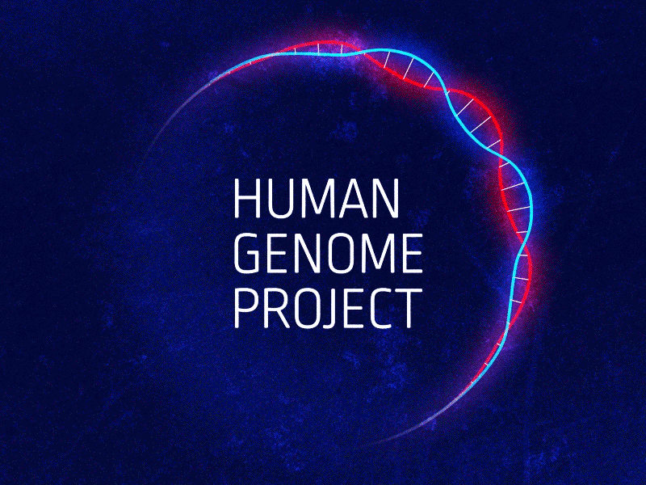
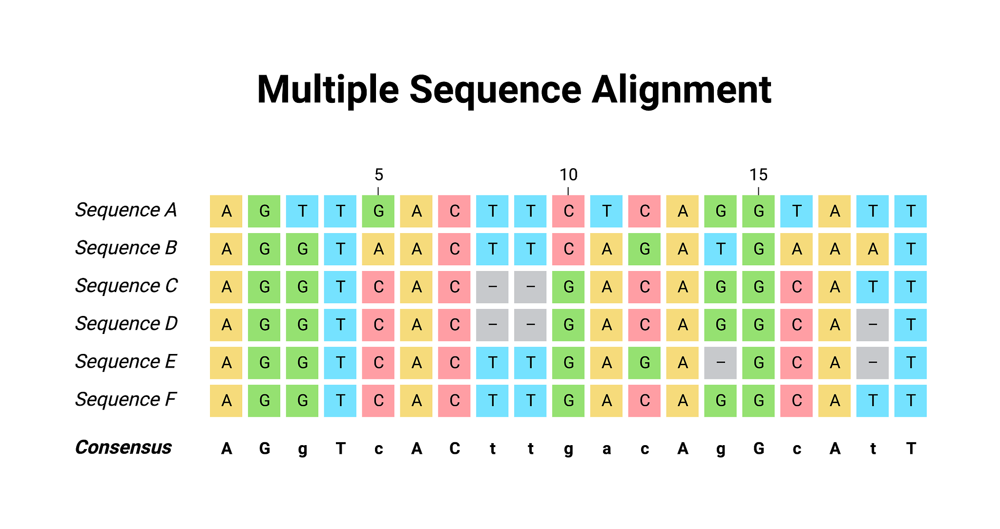

<link rel="icon" href="http://github.com/doctopus/RNASeq" />

 
# [Official Resources &#9650;](#___top "click to go to top of document")

Steps:
  `rsync -r --progress /mnt/isilon/w_stemcell/yuj2lab/Tapas/scripts/ .`

